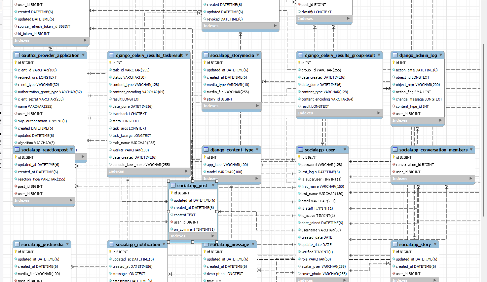
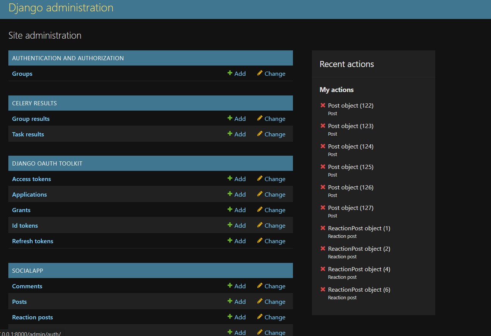
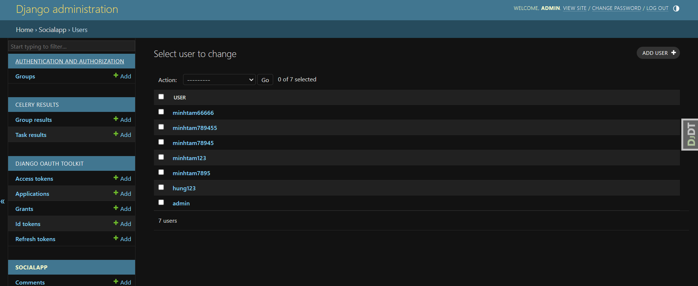
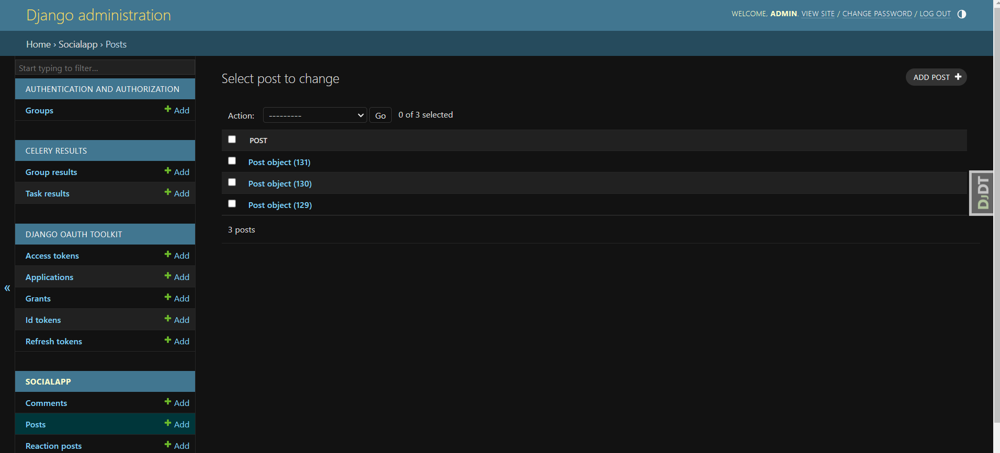
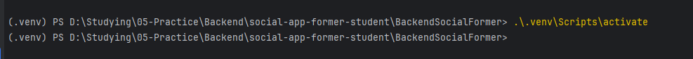
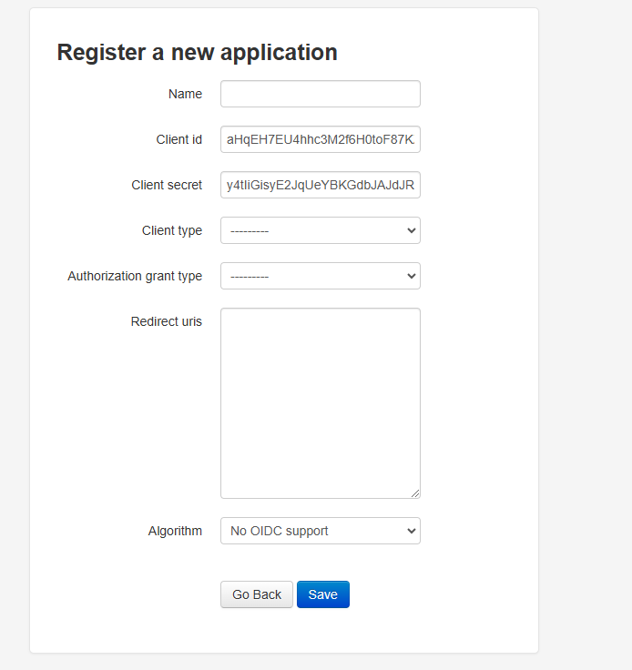
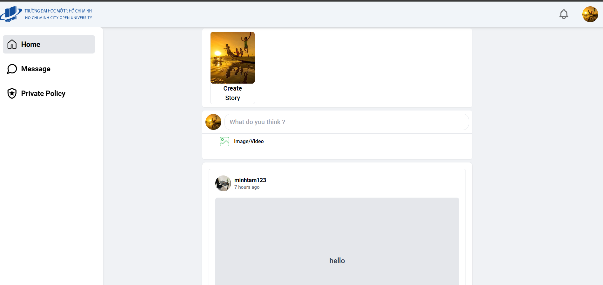
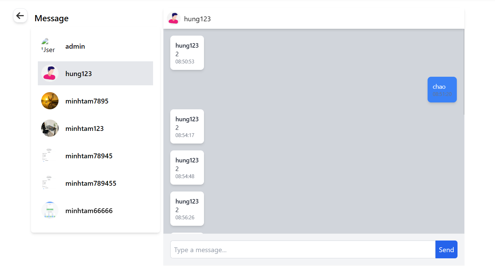
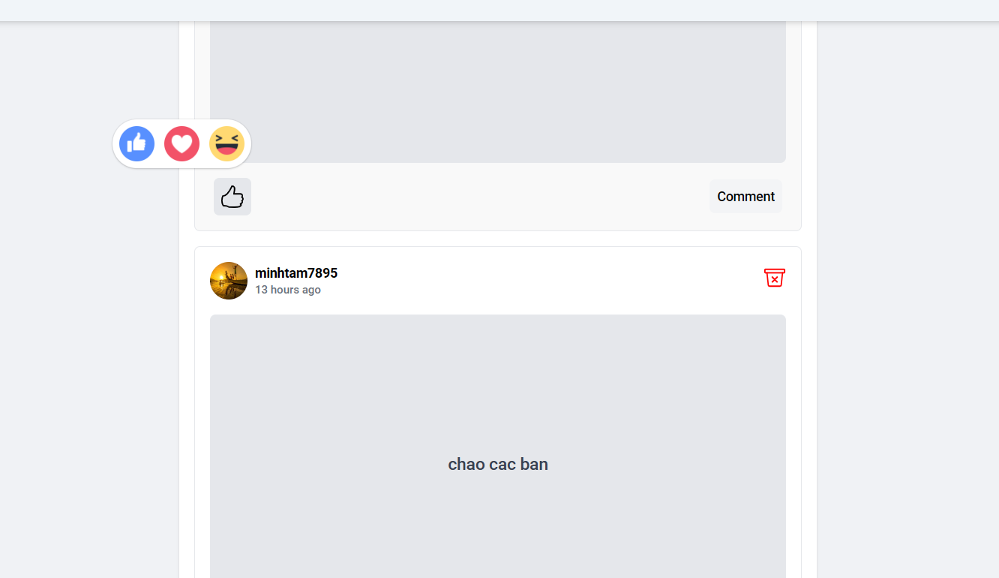

[](https://skillicons.dev)

# The Social for the student

We built the social page for the student purpose to connect all the students, even old student also use it with the function to react the post and chat real time or upload stories around 24

# Table of content

## Table of Contents

1. [Database Schema](#database-schema)
2. [Feature](#feature)
3. [Setup and Installation](#set-up)
4. [User interface](#user-interface)
5. [Contact](#contact)

## Database Schema



## Feature

- **User Authentication**: Secure login and registration using OAuth2.
- **Stories**: Users can upload stories that expire in 24 hours, including images and videos.
- **Real-time Chat**: Utilizes Redis server on port 6937 and Django Channels for WebSocket communication.
- **Notifications**: Users receive real-time notifications for new followers and other activities.
- **Posts**: Users can view and interact with posts, including reactions, comments, and nested replies categorized as neutral, positive, or negative.

- **Admin site**
<div style="display: grid; grid-template-columns: repeat(2, 1fr); gap: 20px;">







</div>

## Setup and Installation

```bash
git clone https://github.com/MinhTamNT/Social_Student_TS.git
```

Front-end

```bash
cd CLient
npm install
```

- You must create the file .env.development with content :

```bash
VITE_LOCAL_HOST_URL = URL BACKEND
VITE_CLIENT_ID =  CLIENT ID
VITE_CLIENT_SECRET =  CLIENT SERCET

```

Backend

- Open to pycharm and open folder BackendRentAccommodation
- After you must install venv in setting -> project BackendRentAccommodation -> python interperter -> select python version and create

AFTER

```python
.\.venv\Scripts\activate

```

When usen seen the .venv or venv like that


- You will install it

```python
pip install -r requirements.txt
```

And run project

```python
py manage.py runserver
```

- if you run project backend success you will register admin site because you must have client id and client secret for user login by oauth 2 toolkit

Stop run

```bash
Ctrl + c
```

```bash
python manage.py createsuperuser
```

You fill out and label the require after run project and login with role admin site

```bash
py manage.py runserver
```

```bash
http://127.0.0.1:8000/admin/
```

- After you must app for the client id and client secret

```bash
http://127.0.0.1:8000/o/applications/register/

```

# First, you fill out it but remember you must copy client id and client secret after click save



```bash
Client type : Confidential
Authorzation grant type : Resource owner password-based
```

- and click save

# Open folder Text-classify and congfiguration with backend

- Open to pycharm and open folder
- After you must install venv in setting -> project Text-classify -> python interperter -> select python version and create

```python
pip install -r requirements.txt
```

- And run click right mosuse and run project

## User Interface

<div style="display: grid; grid-template-columns: repeat(3, 1fr); gap: 20px;">
  
  
  
</div>

## Contact
 - Email : minhtam78945@gmail.com
 - GitHub : https://github.com/MinhTamNT